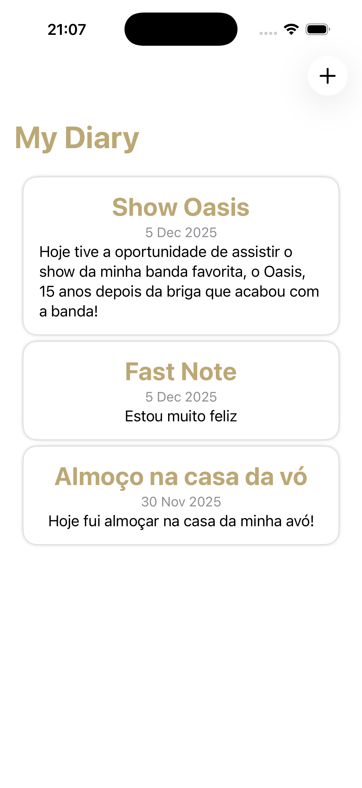
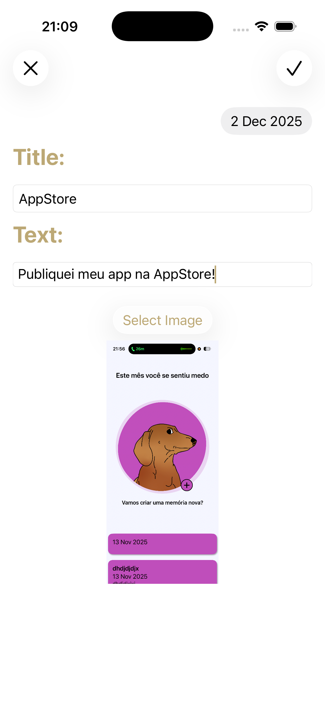
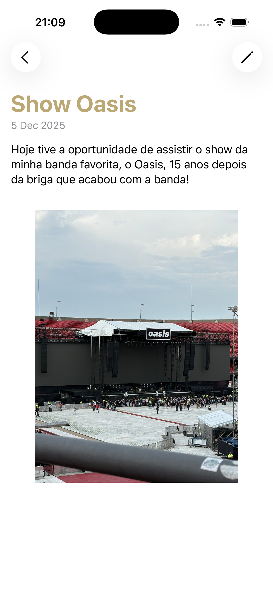
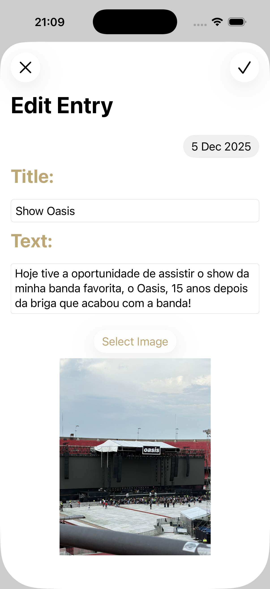
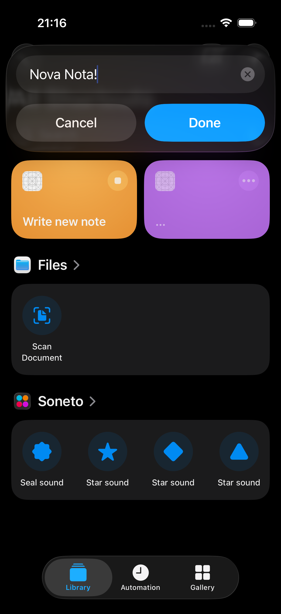

# OpenAcademyProject
Este projeto é o resultados das aulas do curso da OpenAcademy de Tópicos Avançados de iOS. Desenvolvido em Swift e SwiftUI, para iOS 26, a ideia era fazer um diário utilizando pelo menos 3 dos assuntos apresentados nas aulas. <br>

O Projeto consiste de quatro tela principais, a Home, onde o usuário consegue ver todas as entradas do diário, a página de adição, onde o usuário consegue adicionar novos relatos no diário, a página da entrada, onde é possível ver todos os detalhes do que o usuário fez no dia e a edição, onde é possível alterar alguma informação previamente colocada. <br>

Além disso, com o uso do AppIntents, é possível criar uma entrada nova utilizando um Shortcut. Além do AppIntent, outras ferramentas utilizadas incluem o SwiftData e, para se adequar a proposta do projeto, foram utilizadas Tasks, para carregar e atualizar as imagens e extension, para criar novos estilo nos Texts.

### Home:


### Criação:


### Visualização:


### Edição:


### Atalho:


### Uso Extension:
```swift
extension Text {
    func titleStyle() -> some View {
        self
            .foregroundStyle(Color.accentColor)
            .fontWeight(.bold)
            .font(.title)
    }
    
    func largeTitleStyle() -> some View {
        self
            .foregroundStyle(Color.accentColor)
            .fontWeight(.bold)
            .font(.largeTitle)
    }
    
    func textStyle() -> some View {
        self
            .foregroundStyle(.black)
            .fontWeight(.regular)
            .font(.body)
            .multilineTextAlignment(.leading)
    }
    
    func dateStyle() -> some View {
        self
            .foregroundStyle(.gray)
            .font(.subheadline)
            .fontWeight(.regular)
    }
}
```

### AppIntent: 

```swift
struct WriteIntent: AppIntent {
    static var title: LocalizedStringResource = "Write new note"
    static var description = IntentDescription("Write new diary entry")
    static var openIntent = true
    
    @Parameter(title: "Note ID")
    var text: String
    
    init() { }
    
    init(text: String) {
        self.text = text
    }
    
    func perform() async throws -> some IntentResult {
        let modelContext = ModelContext(try ModelContainer(for: Diary.self))

        let newEntry = Diary(date: Date(), text: text, title: "Fast Note")
        modelContext.insert(newEntry)
        
        try modelContext.save()
        return .result()
    }
}
```

### Task:

```swift
Task {
    if let loaded = try? await pickerImage?.loadTransferable(type: Data.self) {
        image = loaded
    } else {
        print("Failed")
    }
}
```


